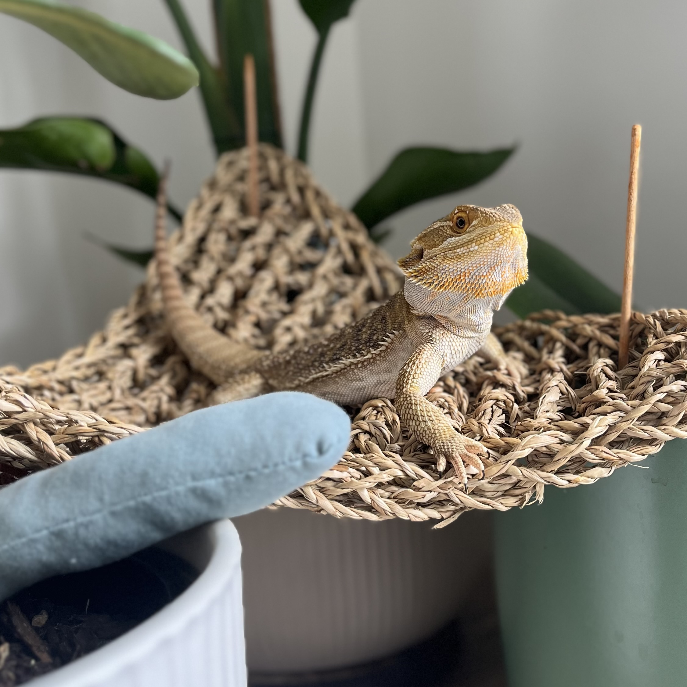

# **pytorch-dragon**
---

<div align="center">
  
</div>


<div align="center">
A deep learning pytorch utilities library for a variety of tasks. See [Features](#features) for the list of modules. The package was named for my lizard Malik, be nice.
</div>


  - PyPI Link : [pytorch-dragon](https://pypi.org/project/pytorch-dragon/)
  - Author : Campbell Rankine
  - Version : v0.2.4
  - Dependencies:
    - Python $\geq$ 3.10
    - setuptools $\geq$ 61.0
    - torch == 2.2.2

## Table of Contents : 🔗

  - [Installation](#installation)
  - [Usage](#usage)
  - [Features](#features)

### Installation : ✔️
  pytorch-dragon can be installed with pip/pip3 using the following:

  ```sh
    pip install pytorch-dragon
    pip3 install pytorch-dragon

    pip install -U pytorch-dragon
    pip3 install -U pytorch-dragon
  ```

### Usage : 🎆
  To import the different extension libraries you can use the following python examples to import the modules:

  ```sh
    import pytorch_dragon as dragon
    
    from pytorch_dragon import utils
    from pytorch_dragon import acquisition.functions

    from pytorch_dragon.pytorch_dragon import sobel_filter
  ```

### Features : 📜

  - acquisition : Acquisition functions for bayesian optimization.
  - search : Hyperparameter search classes and utilities. (Bayes Opt)
    - Bayes opt continuous search.
    - Gaussian Process Regressor
    - Vizier Gaussian Process Bandit (No evolutionary Argmax)
  - backgrop : Gradient Accumulation (DL Training Module)
    - Gradient Accumulation
  - tools : Model utils, Pruning, Logging, etc.
    - Base Pruning
    - Distinctiveness pruning 
    - Tensor function window
    - MADDPG Replay buffer
    - OU Action noise for Policy Gradient based Agents
    - Computer Vision CNN extension pytorch nn.Module's (from RGB, to RGB, Equalized2DConv, etc.)
    - CUDA optimized Sobel Filter (from dragon import sobel_filter)
  - utils : Utility functions (normally for internal use)
